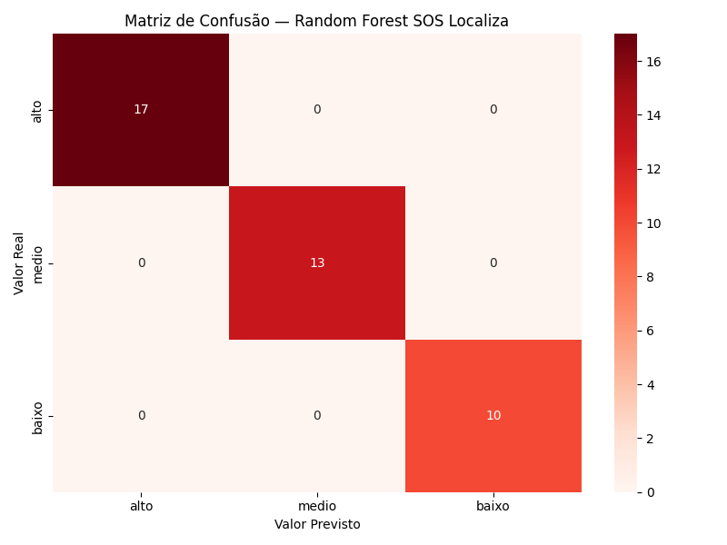

# 🚨 SOS Localiza — Entrega IoT
 
> Implementação do modelo de Inteligência Artificial integrado ao Oracle APEX com demonstração funcional via API REST.
 
---
 
## 📋 Índice
 
- [Sobre a Entrega](#sobre-a-entrega)
- [Vídeo Pitch](#vídeo-pitch)
- [Tecnologias Utilizadas](#tecnologias-utilizadas)
- [Modelo de IA](#modelo-de-ia)
- [Integração com Oracle APEX](#integração-com-oracle-apex)
- [API REST](#api-rest)
- [Fluxo de Integração](#fluxo-de-integração)
- [Evidências de Execução](#evidências-de-execução)
- [Como Executar](#como-executar)
- [Arquivos do Repositório](#arquivos-do-repositório)
- [Equipe](#equipe)
---
 
## 📌 Sobre a Entrega
 
Esta entrega implementa o modelo de **Inteligência Artificial (Random Forest)** definido na sprint anterior, integrando-o à aplicação **Oracle APEX** via API REST (ORDS).
 
O modelo analisa dados de áreas urbanas e periféricas de São Paulo e classifica cada região com um nível de risco de alagamento:
 
- 🔴 **Alto** — região com alta taxa de ocorrências por habitante
- 🟡 **Médio** — região com taxa moderada
- 🟢 **Baixo** — região com baixa incidência
O resultado da IA é salvo diretamente no banco Oracle e exposto via API REST, sendo consumido pelo aplicativo mobile SOS Localiza.
 
---
 
## 🎬 Vídeo Pitch
 
📹 **Link do YouTube:** [INSERIR LINK AQUI]
 
> Vídeo de aproximadamente 5 minutos demonstrando o modelo de IA treinado, a integração com Oracle APEX e o funcionamento da API REST.
 
---
 
## 🛠️ Tecnologias Utilizadas
 
| Tecnologia | Finalidade |
|-----------|-----------|
| Python 3 | Treinamento e execução do modelo de IA |
| Scikit-learn | Biblioteca de Machine Learning |
| Random Forest | Algoritmo de classificação de risco |
| Google Colab | Ambiente de treinamento da IA |
| Oracle APEX 26 | Plataforma de backend e CRUD visual |
| Oracle Database | Banco de dados relacional |
| ORDS | Exposição da API REST |
| PL/SQL | Lógica de negócio no banco de dados |
 
---
 
## 🤖 Modelo de IA
 
### Algoritmo escolhido
**Random Forest** — ensemble de 100 árvores de decisão com profundidade máxima de 5.
 
Escolhido por ser robusto com datasets pequenos, resistente a overfitting e por trabalhar bem com variáveis numéricas e categóricas simultaneamente.
 
### Features utilizadas para classificação
 
| Feature | Tipo | Descrição |
|---------|------|-----------|
| `ocorrencias` | Numérica | Número de ocorrências registradas na área |
| `populacao` | Numérica | População estimada da região |
| `taxa_ocorrencias` | Calculada | Ocorrências por 1000 habitantes |
| `tipo_area_encoded` | Categórica | Tipo de área: URBANA ou PERIFERICA |
 
### Pré-processamento
 
```python
# Taxa calculada igual à lógica do PL/SQL Oracle
df['taxa_ocorrencias'] = (df['ocorrencias'] / df['populacao']) * 1000
 
# Encoding da variável categórica
le_tipo = LabelEncoder()
df['tipo_area_encoded'] = le_tipo.fit_transform(df['tipo_area'])
```
 
### Resultado do treinamento
 
| Métrica | Valor |
|---------|-------|
| Algoritmo | Random Forest |
| Estimadores | 100 árvores |
| Acurácia | **100%** |
| Registros de treino | 160 |
| Registros de teste | 40 |
 
### Relatório de classificação
 
```
              precision    recall  f1-score   support
 
        alto       1.00      1.00      1.00        17
       baixo       1.00      1.00      1.00        10
       medio       1.00      1.00      1.00        13
 
    accuracy                           1.00        40
```
 
### Matriz de Confusão
 

 
---
 
## 🔗 Integração com Oracle APEX
 
### Lógica de negócio no banco
 
Além do modelo de IA, o Oracle APEX executa uma função PL/SQL chamada `calcular_risco` que serve como fallback quando o resultado da IA ainda não foi calculado para uma área:
 
```sql
-- Taxa de ocorrências por 1000 habitantes
v_taxa := (p_ocorrencias / p_populacao) * 1000;
 
-- Score base
IF v_taxa >= 15 THEN v_score := 3;       -- Alto
ELSIF v_taxa >= 5 THEN v_score := 2;     -- Médio
ELSE v_score := 1;                        -- Baixo
END IF;
 
-- Ajuste por tipo de área
IF p_tipo_area = 'PERIFERICA' THEN v_score := v_score + 1;
END IF;
```
 
### View com priorização da IA
 
```sql
CREATE OR REPLACE VIEW vw_areas_risco_api AS
SELECT
    ROUND(latitude, 6)  AS latitude,
    ROUND(longitude, 6) AS longitude,
    CASE
        WHEN risco_ia IS NOT NULL THEN risco_ia        -- usa resultado da IA
        ELSE calcular_risco(ocorrencias, populacao, tipo_area)  -- fallback PL/SQL
    END AS risco_previsto
FROM areas_risco
WHERE ativo = 'S';
```
 
### CRUD completo no APEX
 
O Oracle APEX possui interface visual com CRUD completo da tabela `areas_risco`:
 
| Operação | Descrição |
|----------|-----------|
| CREATE | Cadastro de nova área via formulário |
| READ | Listagem de todas as áreas com Interactive Report |
| UPDATE | Edição de dados e recálculo de risco |
| DELETE | Remoção de área com confirmação |
 
---
 
## 🔌 API REST
 
**Base URL:** `https://oracleapex.com/ords/oracle_soslo/risco`
 
### Endpoints disponíveis
 
| Método | Endpoint | Descrição |
|--------|----------|-----------|
| GET | `/areas` | Lista todas as áreas com risco calculado pela IA |
| POST | `/areas` | Cadastra nova área de risco |
| PUT | `/areas/:id` | Atualiza dados de uma área |
| DELETE | `/areas/:id` | Remove uma área |
 
### Exemplo de resposta GET /areas
 
```json
{
  "items": [
    {
      "latitude": -23.692233,
      "longitude": -46.501288,
      "risco_previsto": "alto"
    },
    {
      "latitude": -23.662131,
      "longitude": -46.519193,
      "risco_previsto": "medio"
    },
    {
      "latitude": -23.523133,
      "longitude": -46.599391,
      "risco_previsto": "baixo"
    }
  ],
  "count": 25
}
```
 
---
 
## 🔄 Fluxo de Integração
 
```
┌─────────────────────────────────────────────────────────┐
│  1. TREINAMENTO (Google Colab)                          │
│                                                         │
│  Dataset (200 registros)                                │
│       ↓                                                 │
│  Pré-processamento                                      │
│       ↓                                                 │
│  Random Forest → Acurácia 100%                          │
│       ↓                                                 │
│  modelo_risco.pkl + encoder_tipo.pkl                    │
└────────────────────────┬────────────────────────────────┘
                         │
                         ▼
┌─────────────────────────────────────────────────────────┐
│  2. INTEGRAÇÃO (Python → Oracle)                        │
│                                                         │
│  Carrega modelo_risco.pkl                               │
│       ↓                                                 │
│  Lê 25 áreas de São Paulo                              │
│       ↓                                                 │
│  Gera previsão: alto / medio / baixo                    │
│       ↓                                                 │
│  Salva coluna risco_ia no Oracle                        │
└────────────────────────┬────────────────────────────────┘
                         │
                         ▼
┌─────────────────────────────────────────────────────────┐
│  3. EXPOSIÇÃO (Oracle APEX + ORDS)                      │
│                                                         │
│  View vw_areas_risco_api                                │
│       ↓                                                 │
│  API REST GET /risco/areas                              │
│       ↓                                                 │
│  JSON com latitude, longitude, risco_previsto           │
└────────────────────────┬────────────────────────────────┘
                         │
                         ▼
┌─────────────────────────────────────────────────────────┐
│  4. CONSUMO (App Mobile React Native)                   │
│                                                         │
│  Fetch API → Plota no mapa → Exibe risco por cor        │
└─────────────────────────────────────────────────────────┘
```
 
---
 
## 📊 Evidências de Execução
 
### Previsões geradas pelo modelo para as 25 áreas
 
| Nível de Risco | Quantidade | Percentual |
|---------------|-----------|-----------|
| 🔴 Alto | 19 áreas | 76% |
| 🟡 Médio | 4 áreas | 16% |
| 🟢 Baixo | 2 áreas | 8% |
 
### API retornando resultado da IA
 
A API em produção pode ser acessada em:
```
https://oracleapex.com/ords/oracle_soslo/risco/areas
```
 
### Log de execução
 
Veja o arquivo `sos_localiza.log` para detalhes completos da execução do modelo.
 
---
 
## 🚀 Como Executar
 
### Pré-requisitos
- Python 3.8+
- Conta Oracle APEX
- Google Colab (recomendado) ou Jupyter Notebook
### 1. Instalar dependências Python
 
```bash
pip install scikit-learn pandas numpy matplotlib seaborn
```
 
### 2. Executar o notebook de IA
 
```
Abrir: sos_localiza_ia.ipynb no Google Colab
Executar todas as células em ordem
```
 
O notebook irá:
- Criar o dataset de treinamento
- Treinar o modelo Random Forest
- Gerar a matriz de confusão
- Salvar `modelo_risco.pkl` e `encoder_tipo.pkl`
- Aplicar previsões nas 25 áreas reais
### 3. Configurar o banco Oracle
 
Execute o arquivo `apex_updates.sql` no **SQL Workshop → SQL Commands** do Oracle APEX:
 
```
Contém:
- Criação da tabela areas_risco
- Função PL/SQL calcular_risco
- View vw_areas_risco_api
- Inserção das 25 áreas
- Atualização do risco_ia com resultado da IA
```
 
### 4. Verificar a API
 
Abra no navegador:
```
https://oracleapex.com/ords/oracle_soslo/risco/areas
```
 
Deve retornar JSON com as 25 áreas e o campo `risco_previsto` preenchido pelo modelo de IA.
 
---
 
## 📁 Arquivos do Repositório
 
| Arquivo | Descrição |
|---------|-----------|
| `README.md` | Documentação completa do projeto |
| `sos_localiza_ia.ipynb` | Notebook com treinamento completo do modelo |
| `modelo_risco.pkl` | Modelo Random Forest serializado |
| `encoder_tipo.pkl` | Encoder do campo tipo_area |
| `matriz_confusao.png` | Evidência visual do modelo treinado |
| `apex_updates.sql` | Scripts SQL completos do Oracle APEX |
| `sos_localiza.log` | Log de execução com entradas e saídas da IA |
 
---
 
## 👨‍💻 Equipe
 
| Nome | RM |
|------|----|
| Amanda Galdino | 560066 |
| Bruno Cantacini | 560242 |
| Gustavo Gonçalves | 556823 |
 
---
 
*Projeto acadêmico desenvolvido na FIAP — 2026*
 
